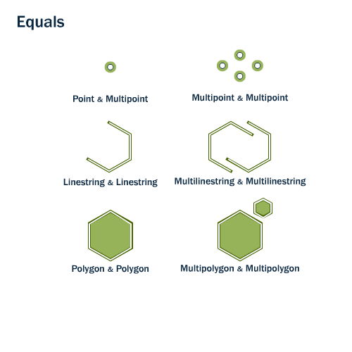
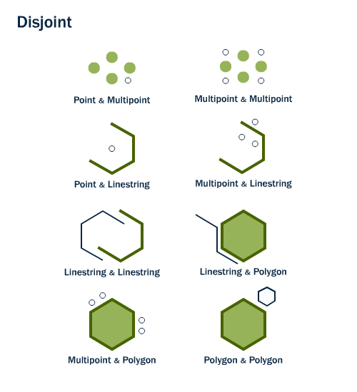
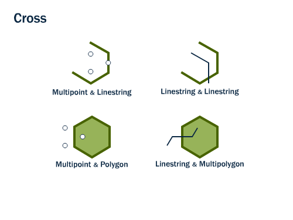
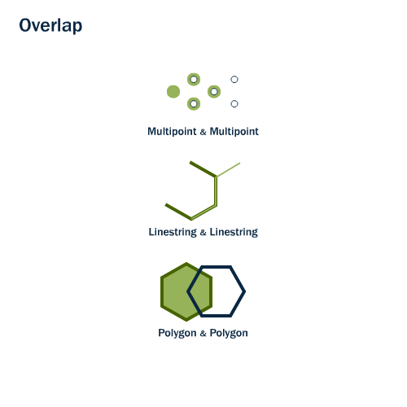
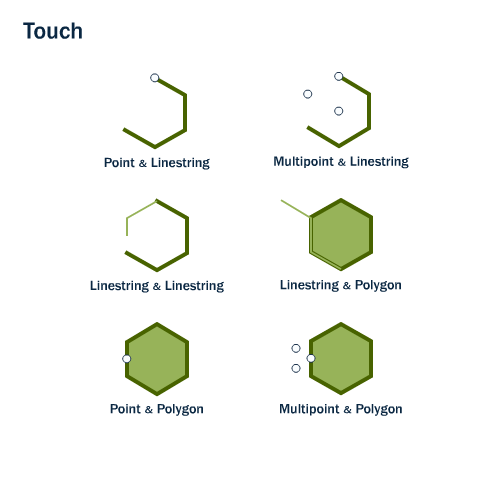
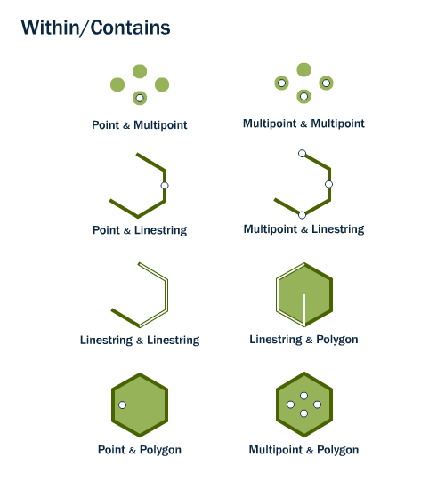
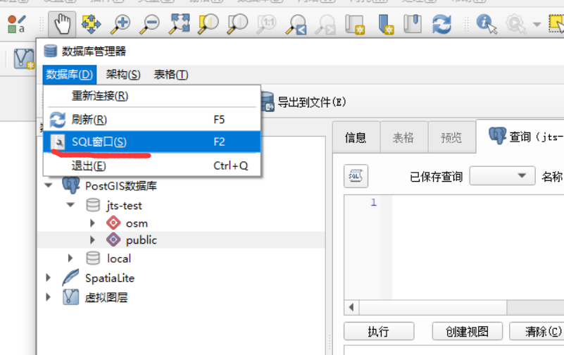
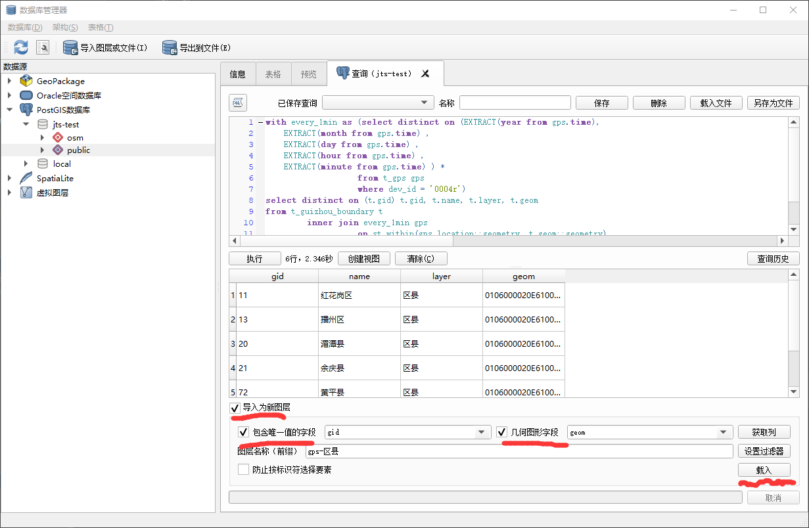
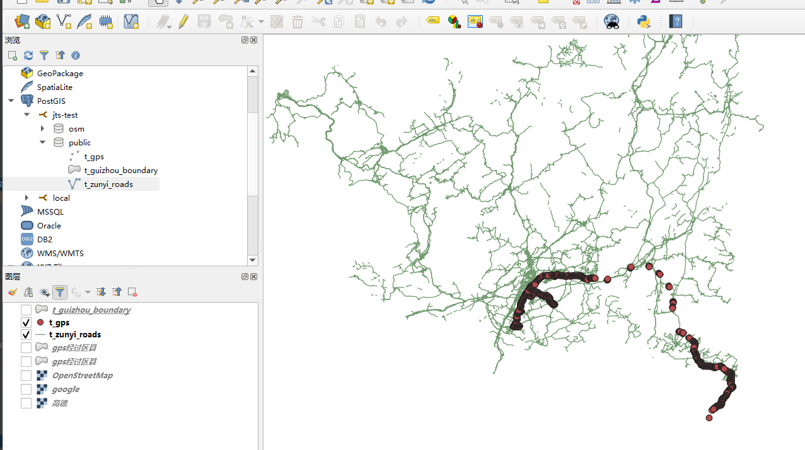
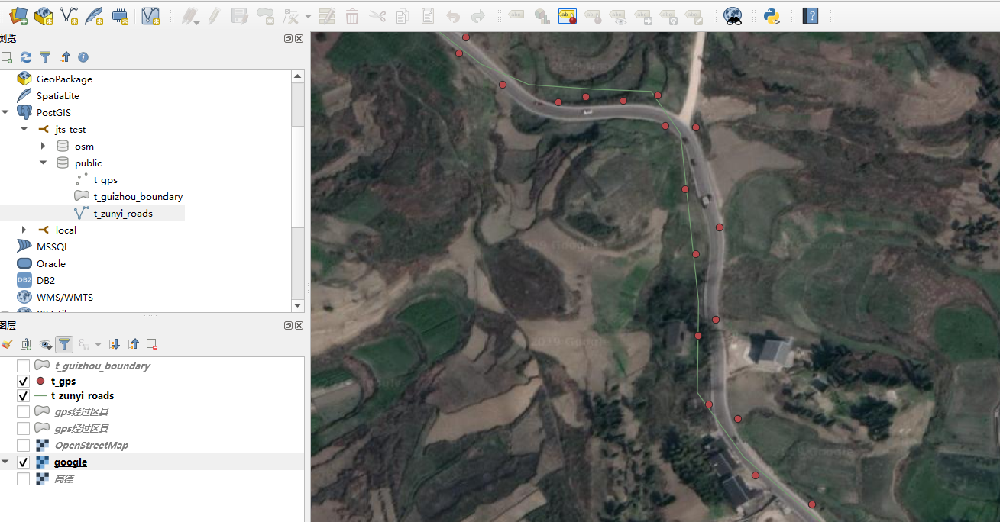

# 在java程序中使用postgis进行地理位置数据分析

前面的两篇文章[在java中使用postgis操作地理位置数据](../01-postgis/README.md)、
[使用JTS与postgis进行空间数据交互](使用JTS与postgis进行空间数据交互.md)
，已经搞定基本的地理位置数据的curd了。

但在实际业务中，我们还需要对数据进行分析。比如之前我们使用的gps轨迹信息，我们希望
从中获取到比如，车辆经过的区县有哪些？行经的轨迹有多长？gps坐标有误差，希望对其
坐标点进行绑路等等

下面的内容中，会对如何分析位置数据进行简单介绍，包含sql与qgis的使用等。

## 1 环境说明

- jdk11
- gradle6
- postgres11+postgis
- idea 2019.3
- qgis 3.8.3-Zanzibar

## 2 预备工作

除了之前已经准备好的postgres，pgadmin以外。为了更好的对数据作可视化，
我们还需要使用专门的gis软件，这里使用免费的[QGIS]来进行分析。

在qgis官网https://qgis.org/zh_CN/site/ 中下载并安装好后，基本的准备工作
就完成了

## 3 准备数据

如果使用源码启动项目，表结构与数据会自动创建。详细的sql在`02-jts/src/main/resources/db/migration`中。

除了gps轨迹数据外，我们这次还加入了道路与行政区规划的信息，在这三个数据间，我们来进行
基本的数据分析。

```postgresql
CREATE TABLE "t_gps"
(
    "time"     timestamptz(3)        NOT NULL,
    "dev_id"   varchar(36)           NOT NULL,
    "location" geography(Point, 4326) NOT NULL,
    "gps_num"  int4,
    "gps_type" varchar(10)           NOT NULL,
    "azimuth"  float4,
    "gnd_rate" float4
) WITHOUT OIDS;
```

这张表包含了贵州的行政区规划，包含省、市、区县、乡镇4个层级
```postgresql
CREATE TABLE "t_guizhou_boundary"
(
    "gid"   SERIAL primary key,
    "name"  varchar(40),
    "layer" varchar(10),
    "code"  varchar(80),
    "geom"  geography(MULTIPOLYGON, 4326)
) WITHOUT OIDS;

COMMENT ON table "t_guizhou_boundary" is '贵州行政区规划';
COMMENT ON column "t_guizhou_boundary"."layer" is '行政区等级';
```

这是遵义市的路网数据，后面我们会分析gps轨迹与道路的关系
```postgresql
CREATE TABLE "t_zunyi_roads"
(
    "gid"   SERIAL primary key,
    "name"  varchar(40),
    "level" varchar(10),
    "geom"  geography(LineString, 4326)
) WITHOUT OIDS;

COMMENT ON table "t_zunyi_roads" is '遵义市区道路';
COMMENT ON column "t_zunyi_roads"."level" is '道路等级';
```

## 4 空间几何数据类型与关系的说明

传统的数据库数据保存的都是1维数据，关系无非就是`大于>` `小于<` `等于=`这些，但现在的几何数据是二维（其实postgis可以分析3维，但本文不设计）。
数据关系已经大为复杂。

### 4.1 几何类型 

首先在postgis中，[基本的几何类型][geometries]有：

#### 点（Points）


#### 线串（Linestring）


#### 多边形（Polygon），注意多边形可能会镂空


#### 还有四种集合（Collection）类型  

|   |   |
|---|---|
| MultiPoint         | 点集合     |
| MultiLineString    | 线串集合   |
| MultiPolygon       | 多边形集合  |
| GeometryCollection | 由任意几何图形（包括其他GeometryCollection）组成的异构集合  |

### 4.2 几何关系

然后不同的几何图形间，当然就对应了复杂的[空间关系][spatial_relationships]，下面摘抄
了postgis文档中的关系说明:

### 4.2.1 相等`ST_Equals`



### 4.2.2 相交`ST_Intersects`、`ST_Disjoint`、`ST_Crosses`和`ST_Overlaps`

ST_Intersects、ST_Crosses和ST_Overlaps测试几何图形是否相交。
 


如果两个形状具有任何公共空间，即边界或内部相交，则ST_Intersects（geometry A，geometry B）返回t（TRUE）。



与ST_Intersects相反的是ST_Disjoint（几何A，几何B）。
如果两个几何图形没有重合的部分，则它们不相交，反之亦然。
事实上测试"not intersect"通常比测试"disjoint"更有效，因为intersect测试可以使用空间索引。



对于multipoint/polygon、multipoint/linestring、linestring/linestring、
linestring/polygon和linestring/multipolygon的比较，
如果相交生成的几何图形的维度小于两个源几何图形的最大维度，且相交集位于两个源几何图形的内部，
则ST_Crosses(geometry A, geometry B)将返回TRUE。



ST_Overlaps(geometry A, geometry B)比较两个相同维度的几何图形，
如果它们的结果集与两个源几何图形都不同但具有相同维度，则返回TRUE。

### 4.2.3 边界接触`ST_Touches`

ST_Touches()测试两个几何图形是否在它们的边界上接触，但在它们的内部不相交。



如果两个几何图形的边界相交，或者只有一个几何图形的内部与另一个几何图形的边界相交，
则ST_Touches(geometry A, geometry B)将返回TRUE。

### 4.2.4 在XX内部`ST_Within`和`ST_Contains`

ST_Within()和ST_Contains()测试一个几何图形是否完全位于另一个几何图形内。



如果第一个几何图形完全位于第二个几何图形内，则ST_Within(geometry A, geometry B)
返回TRUE，ST_Within()测试的结果与ST_Contains()完全相反。

如果第二个几何图形完全包含在第一个几何图形内，则ST_Contains(geometry A, geometry B)
返回TRUE。

### 4.2.5 距离与范围内`ST_Distance`和`ST_DWithin`

一个常见的GIS问题是"找到这个物体周围距离X的所有其他物体"。

ST_Distance(geometry A, geometry B)计算两个几何图形之间的最短距离，
并将其作为浮点数返回。这对于实际报告几何图形之间的距离非常有用。

为了测试两个几何图形之间的距离是否在某个范围之内，ST_DWithin()函数提供了一个这样的的功能。

这对于"在距离道路500米的缓冲区内有多少棵树?"这样的问题很有用，你不必计算实际的缓冲区，只需测试距离关系即可。


## 5 数据分析

上面介绍了基本的数据类型与关系分析的函数，在上篇文章工作的基础上，
下面针对gps轨迹（point）、路网（linestring）、行政区边界（polygon），我们会做一些分析。

### 5.1 统计轨迹所经过的区县与QGIS导入sql图层

由于gps坐标是point，所以只要查找每个点在哪个区县就可以了，使用`st_within`。
由于我的表结构中使用的geography进行建模，所以查询时，还需要转换类型为geometry。
这两个类型的主要区别是在某些计算中，后面会说到。

```postgresql
-- 由于gps表数据量较大，这里只取每分钟的第一个gps坐标
with every_1min as (select distinct on (EXTRACT(year from gps.time),
    EXTRACT(month from gps.time) ,
    EXTRACT(day from gps.time) ,
    EXTRACT(hour from gps.time) ,
    EXTRACT(minute from gps.time) ) *
                    from t_gps gps)
select distinct on (t.gid) t.gid, t.name, t.layer, t.geom
from every_1min gps
         inner join t_guizhou_boundary t
                    on st_within(gps.location::geometry, t.geom::geometry)
where gps.time < now()
  and t.layer = '区县'
```


即使减少了gps坐标的量，在我的pc上还是需要2s多。在直接join时（大概7000多个点），
查询花了22s多。

为了更好的分析轨迹坐标与查询结果的关系，我们在[QGIS]中将这个查询作为图层进行导入。
选择 数据库->数据库管理器->数据库->sql窗口




然后在右边的窗口中，就可以将sql放入，然后执行，选择`导入为新图层`，然后载入



最后在qgis中选中刚才的图层和gps表就可以看到结果


### 5.2 线性参考[linear_referencing]与gps轨迹绑路

由于gps设备所采集的坐标会存在误差，车辆的轨迹时常不会在道路上，为了纠正数据就需要绑路了。
百度或高德这些地图服务商一般都有绑路的接口或服务，但调用一般有限制。这里通过路网数据与
[线性参考][linear_referencing]（Linear Referencing）来进行绑路操作。


#### 5.2.1 线性参考简介
线性参考是一种表示要素的方法，这些要素可以通过引用一个基本的线性要素来描述。
比如下面的sql

```postgresql
-- Simple example of locating a point half-way along a line
-- 点在线上
SELECT ST_LineLocatePoint('LINESTRING(0 0, 2 2)', 'POINT(1 1)');
-- Answer 0.5
 
-- What if the point is not on the line? It projects to closest point
-- 点不在线上，直接取点在线上的映射
SELECT ST_LineLocatePoint('LINESTRING(0 0, 2 2)', 'POINT(0 2)');
-- Answer 0.5

--上面的结果是线的参考值，再使用ST_LineInterpolatePoint下面函数就可以得到
-- 映射点的坐标
-- Simple example of locating a point half-way along a line
SELECT ST_AsText(ST_LineInterpolatePoint('LINESTRING(0 0, 2 2)', 0.5));
-- Answer POINT(1 1)
```

这样只要找到合适的gps点的参考路线，就可以通过[线性参考][linear_referencing]来进行绑路了。

#### 5.2.2 实战

`t_zunyi_roads`表中，有遵义市的路网数据



数据是从[OpenStreetMap](https://www.openstreetmap.org)上下载的，将数据和卫星
地图对比，在某些路段OpenStreetMap的数据还是有些问题的……



但我们重点是实现绑路，这些问题就算了。首先，就是需要找到离坐标最近的道路

```postgresql
select gps.time                                                         as time,
       gps.location                                                     as location,
       roads.gid                                                        as road_gid,
       ST_Distance(gps.location, roads.geom)                            as distance,
       ST_LineLocatePoint(roads.geom::geometry, gps.location::geometry) AS measure
from t_gps gps
         left join t_zunyi_roads roads on
    st_dwithin(roads.geom, gps.location, 30, false)
order by gps.time,distance
```

这里除了使用`ST_Distance`来拿到了坐标到线的距离，还计算了该点沿线串的线性参考比例measure。
下面需要使用measure来计算坐标在道路上的映射点。完整sql是

```postgresql
with gps as
         (select gps.time                                                         as time,
                 gps.location                                                     as location,
                 roads.gid                                                        as road_gid,
                 ST_Distance(gps.location, roads.geom)                            as distance,
                 ST_LineLocatePoint(roads.geom::geometry, gps.location::geometry) AS measure
          from t_gps gps
                   left join t_zunyi_roads roads on
              st_dwithin(roads.geom, gps.location, 30, false)
          order by gps.time, distance)
select distinct on (gps.time ,gps.location,roads.gid) gps.time                                                             as gps_time,
                                                      roads.gid                                                            as road_gid,
                                                      ST_LineInterpolatePoint(roads.geom::geometry, gps.measure)::geometry as line_ref
from gps
         left join t_zunyi_roads roads on gps.road_gid = roads.gid
```

这里黄色的点就是绑路后的坐标了，可以看到基本效果还是不错的。


 [QGIS]: https://qgis.org/zh_CN/site/
 [geometries]: http://postgis.net/workshops/postgis-intro/geometries.html
 [spatial_relationships]: http://postgis.net/workshops/postgis-intro/spatial_relationships.html
 [linear_referencing]: http://postgis.net/workshops/postgis-intro/linear_referencing.html
