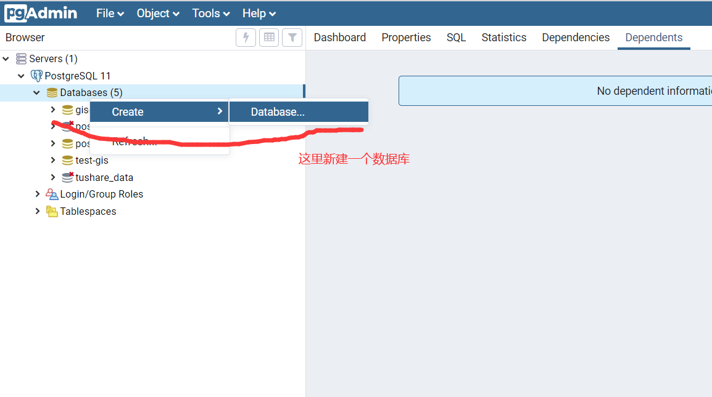
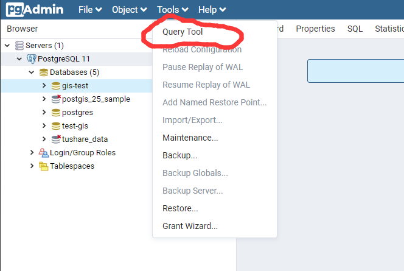
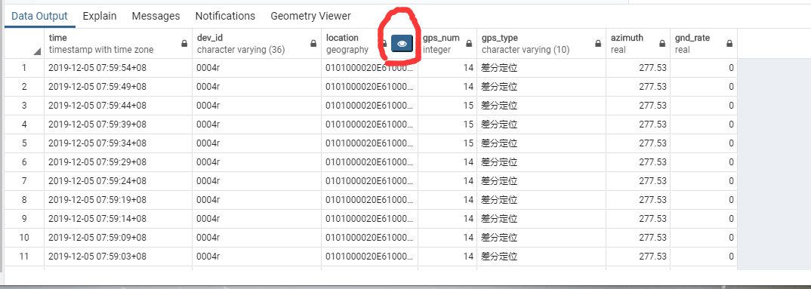

# 在java中使用postgis操作地理位置数据

最近要做gps数据的分析，开始学习postgis。首先推荐下`不睡觉的怪叔叔`的[专栏](https://zhuanlan.zhihu.com/p/67232451)，
里面的postgis教程可以说很全面了，我就是靠这入的坑。

但在java程序中，对gis数据进行操作还有些问题，这里简单用文章记录下。

demo源码在https://gitee.com/Lonelyleaf/postgis-java-demo，下面简单说明下整个过程与遇到的坑


## 1.环境说明

- jdk11
- gradle6
- postgres11+postgis
- idea 2019.3

## 2.预备工作

首先需要安装postgres与postgis，在windows下，安装postgres时可以顺带安装postgis，记得勾选


安装好后，使用pgadmin来新建一个数据库，这里就叫做`gis-test`




然后选中你的数据库，选择上方的`Tools -> Query Tool`打开查询编辑器。



输入以下sql来启用[PostGIS]

> create extension postgis

数据库就准备好了！

## 3.准备数据

如果直接使用我的源码，那么启动项目会自动建立表结构与初始数据。这里还是说明下表结构与数据:


```postgresql
-- 创建gps数据表
CREATE TABLE "t_gps"
(
    "time"           timestamptz(3)         NOT NULL,
    "dev_id"         varchar(36)            NOT NULL,
    "location"       GEOGRAPHY(Point, 4326) NOT NULL,
    "gps_num"        int4,
    "gps_type"       varchar(10)            NOT NULL,
    "azimuth"        float4,
    "gnd_rate"       float4
) WITHOUT OIDS;

COMMENT ON COLUMN "t_gps"."time" IS '时间';
COMMENT ON COLUMN "t_gps"."dev_id" IS '设备ID';
COMMENT ON COLUMN "t_gps"."gps_num" IS '卫星定位数';
COMMENT ON COLUMN "t_gps"."gps_type" IS 'GPS定位信息';
COMMENT ON COLUMN "t_gps"."azimuth" IS '对地真北航向角';
```

这里建立一个gps数据表，其中`location`字段使用的`GEOGRAPHY`来保存坐标信息。
其中`Point`表示是点信息，postgis还支持`Linestring`、`Polygon`等。
后面的4326表示了[SRID]，表明了使用的哪种坐标系，这里是使用的`WGS84`，既gps的
标准坐标。

然后在[这里](https://gitee.com/Lonelyleaf/postgis-java-demo/blob/master/src/main/resources/db/migration/V1.1__gps_sample_data.sql)
下载样本数据的sql，放入数据库中执行。

执行成功后选中数据库，然后`Schemas->Tables`在t_gps表右键`View/Edit Data->All Rows`就能看到刚才导入的数据了,


然后可以看到下面的`Data Output`选项卡中，我们的`location`字段右边有一个👁一样的图标，点击后，可以简单的在地图上
预览到刚才我们导入的数据




要专门分析数据，可以用`qgis`或`arcgis`这些专业的gis软件，这里我们已经初步达成目的，下面说明下java后端程序中，怎样
读写postgis数据。

最后给`location`建立索引，注意要使用[gist索引]来创建。

>create index idx_gpt_location on t_gps using gist("location");

postgis的文档上对[gist索引]有介绍，时专门针对空间数据的一种索引，在

## 4.java后端工程

具体项目请参考我的项目[源码](https://gitee.com/Lonelyleaf/postgis-java-demo)，
基本是按照spring boot的curd工程来搭建。由于用到很多其它技术具体搭建过程这里不细说，
下面简单说明下读写数据的过程和一些痛点。

#### 4.1 java表实体

首先项目使用的是[mybatis-plus]来做crud,下面是`t_gps`表的java实体：

```
@Data
@TableName("t_gps")
public class GpsEntity {
    @ApiModelProperty("时间")
    private Date time;
    @ApiModelProperty("设备id")
    private String devId;
    @ApiModelProperty("位置")
    private org.postgis.Point location;
    @ApiModelProperty("卫星定位数")
    private int gpsNum;
    @ApiModelProperty("GPS定位信息")
    private String gpsType;
    @ApiModelProperty("对地真北航向角")
    private double azimuth;
    @ApiModelProperty("地面速率")
    private double gndRate;
}
```

#### 4.2 postgis的geometry、geography类型问题

注意`org.postgis.Point`在[postgis-jdbc]中，并且为了让jdbc能正确读取数据，需要
将[postgis-jdbc]中的数据进行注册。[postgis-jdbc]提供了自动注册与手动注册。

如果使用自动注册，可以用`org.postgis.DriverWrapper`作为driver，然后jdbc的url使用`jdbc:postgresql_postGIS`
就可以自动注册`org.postgis.Geometry`。但是，源码中支持的数据库类型是`geometry`而不支持`geography`，这两者的
差别可以参考`不睡觉的怪叔叔`和`德哥`的文章

[PostGIS教程十三：地理](https://blog.csdn.net/qq_35732147/article/details/86489918)
[PostGIS距离计算建议 - 投影与球坐标系, geometry与geography类型](https://github.com/digoal/blog/blob/master/201710/20171018_02.md)

为了让`geography`也能自动注册，项目中自定义了`com.github.lonelyleaf.gis.db.DriverWrapper`类，
转换出来还是`org.postgis.Geometry`,在java代码层使用和`geometry`并没做区分。

```
pgconn.addDataType("geography", org.postgis.PGgeometry.class);
pgconn.addDataType("public.geography", org.postgis.PGgeometry.class);
pgconn.addDataType("\"public\".\"geography\"", org.postgis.PGgeometry.class);
```

如果你没有注册类型，那么你拿到的类型会是`org.postgresql.util.PGobject`。但其实通过
`org.postgis.PGgeometry#geomFromString()`还是很可以获取`PGobject#value`来手动转换的。

#### 4.3 mybatis中需要定义TypeHandler

明显mybatis没有原生支持`org.postgis.Geometry`与其各个子类。有个
[mybatis-typehandlers-postgis](https://github.com/eyougo/mybatis-typehandlers-postgis)
做了一些工作，但实在太简单我选择直接copy其中核心代码

```
public abstract class AbstractGeometryTypeHandler<T extends Geometry> extends BaseTypeHandler<T> {

    public void setNonNullParameter(PreparedStatement ps, int i, T parameter, JdbcType jdbcType) throws SQLException {
        PGgeometry geometry = new PGgeometry();
        geometry.setGeometry(parameter);
        ps.setObject(i, geometry);
    }

    public T getNullableResult(ResultSet rs, String columnName) throws SQLException {
        PGgeometry pGgeometry = (PGgeometry) rs.getObject(columnName);
        if (pGgeometry == null) {
            return null;
        }
        return (T) pGgeometry.getGeometry();
    }

    public T getNullableResult(ResultSet rs, int columnIndex) throws SQLException {
        PGgeometry pGgeometry = (PGgeometry) rs.getObject(columnIndex);
        if (pGgeometry == null) {
            return null;
        }
        return (T) pGgeometry.getGeometry();
    }

    public T getNullableResult(CallableStatement cs, int columnIndex) throws SQLException {
        PGgeometry pGgeometry = (PGgeometry) cs.getObject(columnIndex);
        if (pGgeometry == null) {
            return null;
        }
        return (T) pGgeometry.getGeometry();
    }

}

@MappedTypes(Point.class)
public class PointTypeHandler extends AbstractGeometryTypeHandler<Point> {
}
```

注意如果你没有在jdbc connection中注册类型，那`rs.getObject`拿到的会是`org.postgresql.util.PGobject`。

#### 4.4 org.postgis.Geometry的json序列化
         
由于没有现成的`org.postgis.Geometry`转为[GeoJson]的库，所以项目中使用了自定义`SimplePoint`类来
转换一下然后序列化。

```
@Data
@AllArgsConstructor
@NoArgsConstructor
public class SimplePoint {

    private double x;
    private double y;

    public SimplePoint(org.postgis.Point point) {
        this.x = point.x;
        this.y = point.y;
    }
}
```

其实[postgis-jdbc]中有`org.postgis.jts`包，对[JTS]有支持，[JTS]是有jackson库转[GeoJson]的。
如果需要在java层做些地理位置的运算，使用`org.postgis.jts`包应该更好。

#### 4.5 坐标的保存与[SRID]

SRID的选择其实很复杂，详细解释可以参考下`不睡觉的怪叔叔`的文章https://blog.csdn.net/qq_35732147/article/details/86301242。
这里摘抄一段

```
地球不是平的，也没有简单的方法把它放在一张平面纸地图上（或电脑屏幕上），所以人们想出了各种巧妙的解决方案（投影）。

每种投影方案都有优点和缺点，一些投影保留面积特征；一些投影保留角度特征，如墨卡托投影（Mercator）；
一些投影试图找到一个很好的中间混合状态，在几个参数上只有很小的失真。所有投影的共同之处在于，
它们将（地球）转换为平面笛卡尔坐标系，选择哪种投影取决于你将如何使用数据（需要哪些数据特征，面积？角度？或者其他）。
```

[SRID]其实就决定了你的坐标使用的哪种投影，由于我的数据都是标准的gps坐标（经纬度，没有偏移），
所以在转换与建表时，都使用了`srid=4326`。具体数据库应该使用哪种一定要根据业务来，不然使用postgis进行计算与使用
各种gis软件进行分析时一定会出问题。

在转换到`org.postgis.Point`时，项目中写死了srid的值，这不是必须，但为了保证正确最好这样做：
```
default org.postgis.Point toGisPoint(SimplePoint point) {
    Point gisPoint = new Point();
    gisPoint.x = point.getX();
    gisPoint.y = point.getY();
    gisPoint.dimension = 2;
    //WGS84坐标系，也就是GPS使用的坐标
    gisPoint.srid = 4326;
    return gisPoint;
}
```

## 5. 总结

java与postgis交互其实不难，这里是用实体<->表对于的方法在建模。其实实在搞不懂，最次还可以全部靠
xml里手写sql搞定不是🐒

文章只介绍了数据的交互，但postgis的各种强大的空间分析的函数并没有介绍，等业务实践再积累些也许可以
再写一下。

如果对分析有兴趣，再次推荐下大佬`不睡觉的怪叔叔`的[专栏](https://zhuanlan.zhihu.com/p/67232451)


[GeoJson]: https://geojson.org/
[mybatis-plus]: https://mp.baomidou.com
[gist索引]：https://postgis.net/workshops/postgis-intro/indexing.html
[PostGIS]: https://postgis.net/
[SRID]: https://en.wikipedia.org/wiki/Spatial_reference_system
[postgis-jdbc]: https://github.com/postgis/postgis-java
[JTS]: https://github.com/locationtech/jts
[SRID]: https://en.wikipedia.org/wiki/Spatial_reference_system